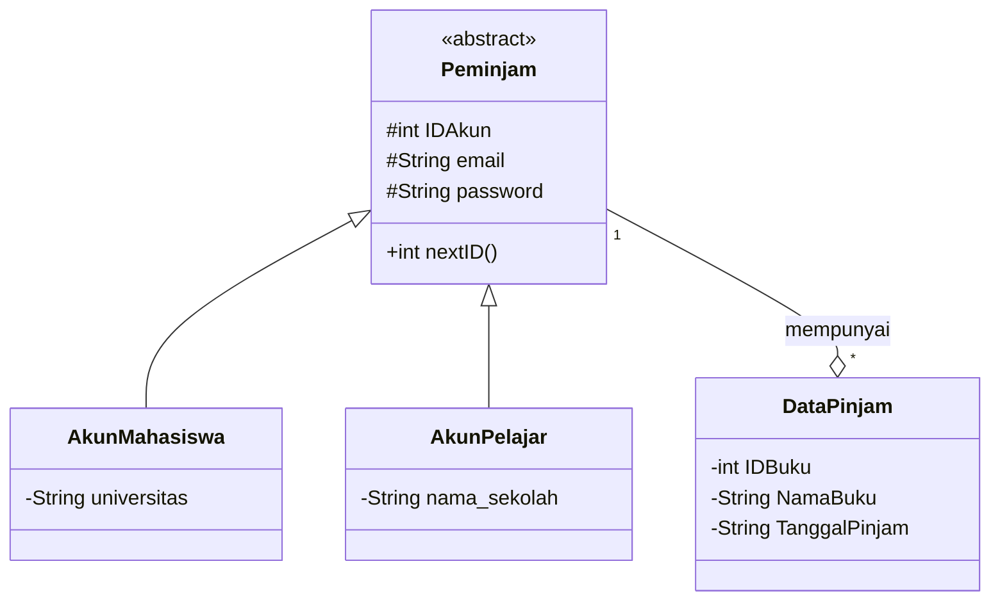
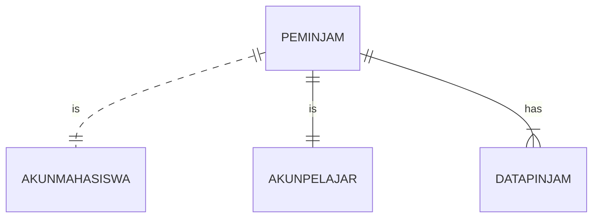
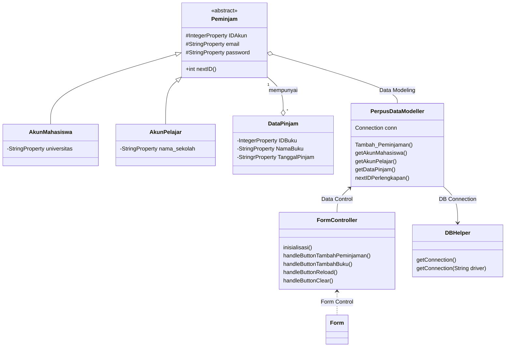

### Nama Anggota Kelompok 
### 1. Diah Adi Sriatna (1917051009)
### 2. Viny Silvia (1917051010)
### 3. Flaurensia Riahta Tarigan (1917051011)

### Pembagian Tugas :
### 1. Membuat Design Database di php myadmin (Flaurensia)
### 2. Membuat Class Diagram di mermaid live editor (Viny)
### 3. Membuat ERD di mermaid live editor (Diah)
### 4. Menyusun file README.md (Diah, Viny, Flauren melalui gmeet)
### 5. Membuat kode program oop di netbeans (Diah, Viny, Flauren melalui gmeet)
### 6. Membuat kode program db helper di netbeans (Diah, Viny, Flauren melalui gmeet)
### 7. Membuat desain GUI di scene builer (Diah, Viny, Flauren melalui gmeet)

### Penjelasan Tugas :
### Program kelompok kami : Sistem Peminjaman Buku di Perpustakaan
### Proses Bisnis yang terjadi sebagai berikut :
### 1. User membuat akun sebagai mahasiswa atau pelajar
### 2. Kemudian user memasukkan ID Akun, email dan password.
### 3. Apabila user adalah mahasiswa maka diperlukan informasi universitas, namun apabila user adalah pelajar  maka diperlukan nama sekolah.
### 4. Setelah akun dibuat, maka user dapat melakukan peminjaman buku dengan mengisi data pinjam berupa ID buku, nama buku, dan tanggal pinjam.
### 5. Satu akun user dapat melakukan lebih dari satu kali peminjaman.
### 6. User dapat menghapus data akun (reload data) dan membersihkan form peminjaman buku (clear form).

> Untuk melihat diagram, install plugin mermaid-diagram di https://github.com/Redisrupt/mermaid-diagrams

### Class Diagram

### ==> Penjelasan Class Diagram
###     Terdapat empat kelas pada class diagram ini, yaitu  :
###     1. Class Peminjam yang bersifat abstak dan sebagai superclass dari dua class lainnya. Di dalam class 
###        ini terdapat atribut : 
###        * IDAkun dengan tipe integer yang bersifat protected
###        * email dengan tipe string yang bersifat protected
###        * password dengan tipe string yang bersifat protected
###        Selain ketiga atribut tersebut, juga terdapat fungsi nextID dengan tipe data integer yang bersifat public.
###     2. Class AkunMahasiswa yang merupakan subclass dari class Peminjam. Di dalam class ini terdapat atribut universitas dengan tipe data 
###        string yang berifat private.
###     3. Class AkunPelajar yang merupakan subclass dari class Peminjam. Di dalam class ini terdapat atribut nama_sekolah dengan tipe data 
###        string yang berifat private.
###     4. Class DataPinjam mempunyai 3 atribut yaitu :
###        * IDBuku dengan tipe integer dan bersifat private
###        * NamaBuku dengan tipe string dan bersifat private
###        * TanggalPinjam dengan tipe String dan berifat private

### ==> Hubungan antara class 
###     1. Hubungan antara class peminjam (sebagai super class) dengan class AkunMahasiswa dan AkunPelajar (sebagai subclass), dihubungkan
###        menggunakan relasi generalization dan menerapkan konsep inheritance. Dimana lambang dari generalization ini adalah garis lurus
###        dengan ujungnya seperti tanda panah.
###     2. Hubungan antara class peminjam dengan class DataPinjam dihubungkan dengan relasi agregation. Yang berarti memiliki relasi 'has a', 
###        yang artinya sebuah class peminjam memiliki bagian class DataPinjam. Namun class DataPinjam tetap ada walaupun tidak mempunya 
###        Peminjam Dimana simbol dari SSagregation adalah garis lurus dengan ujungnya seperti diamond.

### Class Diagram

### ER Diagram
### Satu entity Peminjam teridiri dari satu entity AkunMahasiswa atau satu entity AkunPelajar 
### Satu entity Peminjam dapat mempunyai satu atau lebih entity DataPinjam.

### Design Class Diagram for JavaFX and Database

