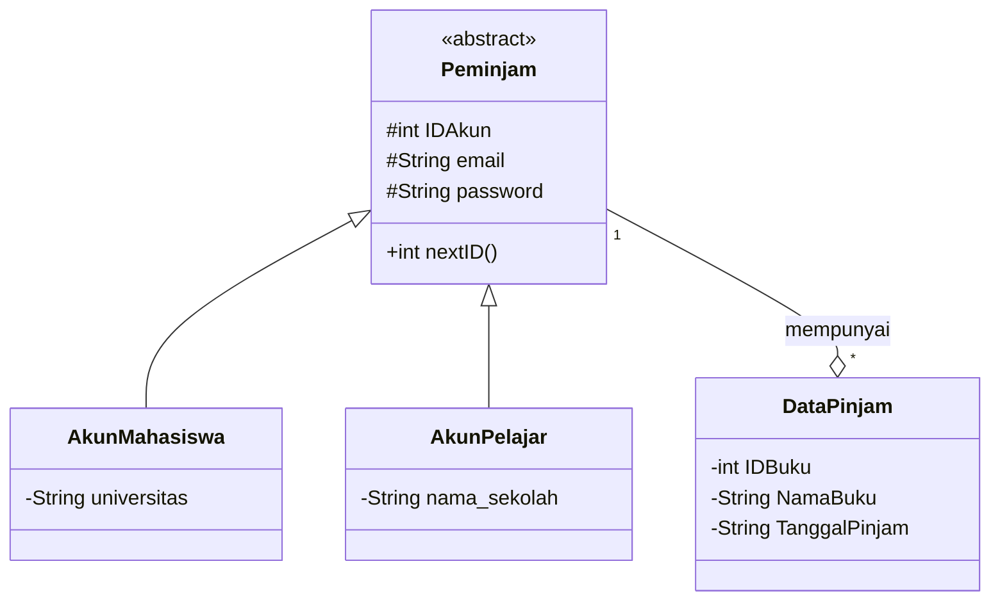
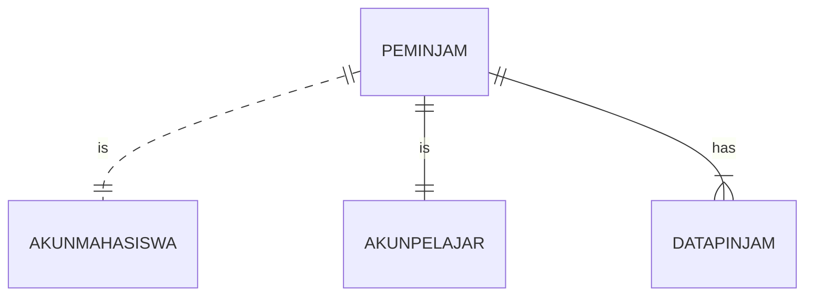
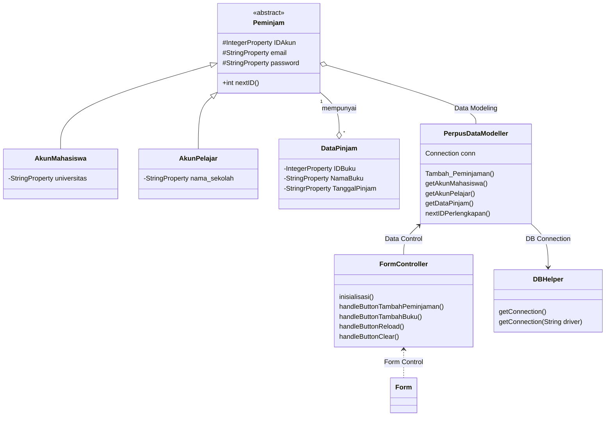

### Nama Anggota Kelompok 
### 1. Diah Adi Sriatna (1917051009)
### 2. Viny Silvia (1917051010)
### 3. Flaurensia Riahta Tarigan (1917051011)

### Pembagian Tugas :
### 1. Membuat Design Database di php myadmin (Flaurensia)
### 2. Membuat Class Diagram di mermaid live editor (Viny)
### 3. Membuat ERD di mermaid live editor (Diah)
### 4. Menyusun file README.md (Diah, Viny, Flauren melalui gmeet)
### 5. Membuat kode program oop di netbeans (Diah, Viny, Flauren melalui gmeet)
### 6. Membuat kode program db helper di netbeans (Diah, Viny, Flauren melalui gmeet)
### 7. Membuat desain GUI di scene builer (Diah, Viny, Flauren melalui gmeet)

> Untuk melihat diagram, install plugin mermaid-diagram di https://github.com/Redisrupt/mermaid-diagrams

### Class Diagram

### ER Diagram

### Design Class Diagram for JavaFX and Database

